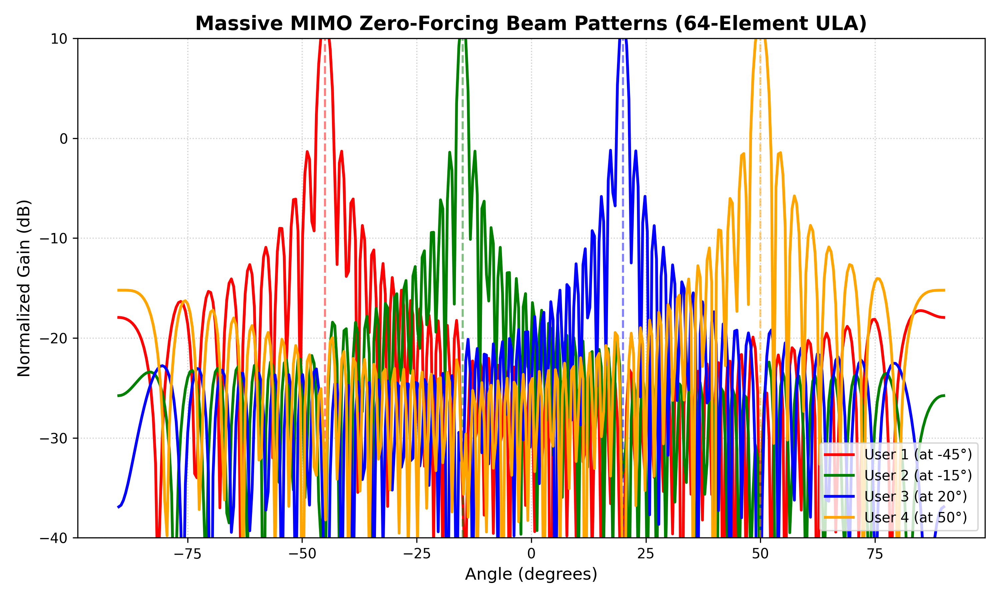

# [Project Name]

## 📌 Project Overview
Briefly describe what the project is. 
* **What it does:** Explain the purpose of the code.
* **The Problem:** Mention the technical challenge you are solving (e.g., multi-user interference in wireless networks).
* **The Solution:** Briefly state the method used (e.g., Zero-Forcing Precoding).

## ⚡ Technical Specifications
* **Language/Toolbox:** Python, NumPy, Matplotlib.
* **Key Concepts:** Massive MIMO, Spatial Multiplexing, Antenna Arrays.
* **System Parameters:** List key variables used (e.g., 64-element ULA, 4 users).

## 📊 Results & Visualization
The simulation confirms high-precision beam steering and effective null-steering for all four users:



## 🛠️ How to Run
## 🛠️ How to Run
Follow these steps to replicate the beamforming simulation on your machine:

1. Clone the repository:
   ```bash
   git clone [https://github.com/mzaib1012/Massive-MIMO-Antenna-Array-Beamforming-and-Spatial-Multiplexing-Simulator.git]
2. Open the notebook in Google Colab or local Jupyter environment.
3. Run the cells sequentially to regenerate the beam patterns.

## 📈 Engineering Impact
Why does this project matter? Discuss the efficiency gained or the interference mitigated, proving you understand the engineering application.
